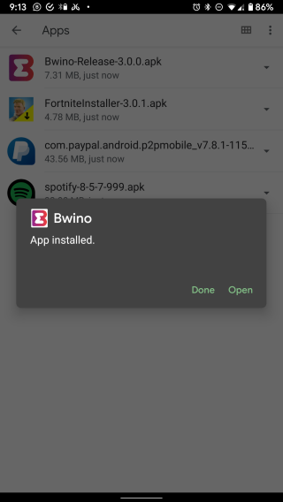
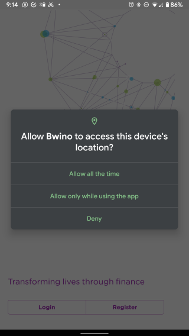

# Installing the Bwino Application

At the moment, the application is only available for Android mobile phones and can be downloaded from [here](https://mage.365.ke/Bwino-Release-3.0.0.apk). After the application is downloaded, the user can go to the download location and install the application. The process is shown below.

## Allow Installation from Unknown Source

As the application was not downloaded from the Google Play Store, the user has to allow the installation from the local file storage by clicking `Settings`, followed by allowing installation from the relevant application.

## Application Installation

After the permissions to install have been given, the user can then proceed to install the application. After a few moments, the application is installed and the user can choose to close the installation dialogue or open the _Bwino_ app.

## Application permissions

The application needs certain permissions in order to function as required. These include access to the users location and access to the users contacts and call logs, including SMS'. Upon opening the application the user will be asked to grant these permissions.

After the required permissions have been granted then the user will be greeted with the application home screen from which they can register a new account (for new clients) or login to an existing account (for existing clients).

