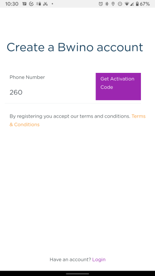
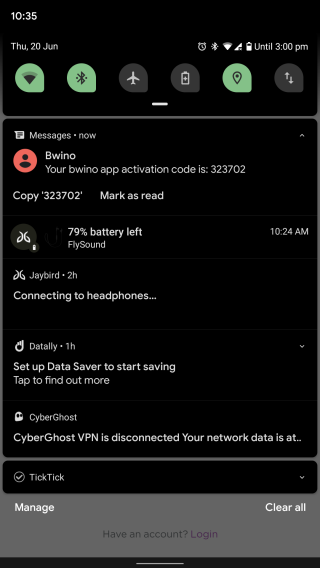
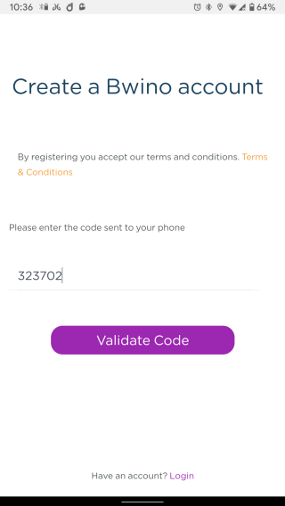
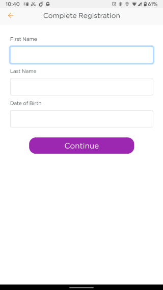
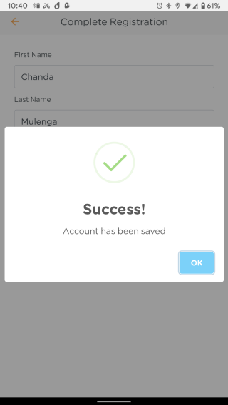
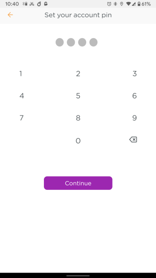
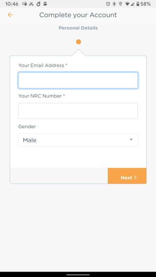
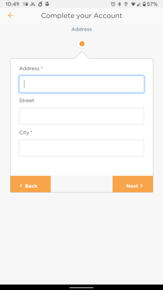
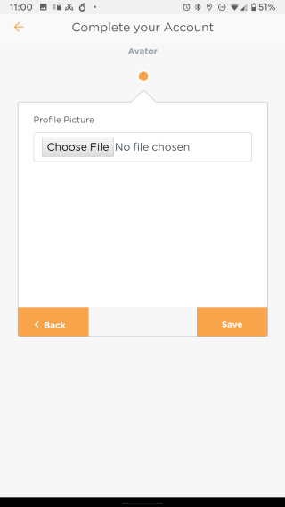
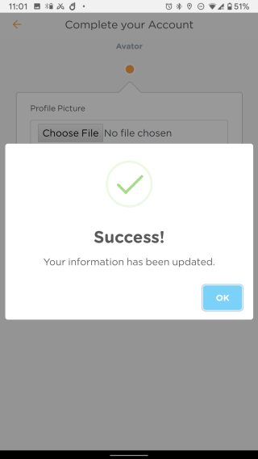

# Registering a New Account on the Bwino Application

After the application has been installed, a new client can then create a Bwino account using their phone number.

## Account Activation

The user is then asked for a phone number to which the Bwino account should be associated. The phone number is also used to receive the activation code for the account. For that reason, the provided phone number must be valid.

The received code must then be entered into the application and upon validation, the user will move to the next phase of registration.

## User Details

After the code has been received and validated, the user can then start entering their personal details.

When the user adds their details successfully, they can now create a 4-digit account pin that is used to secure their account.

After the registration process is done, the user can now login to their account using their phone number and pin code combination.

## Complete Account

Upon logging in for the first time, the user needs to provide a valid email address and NRC (National Registration Card) number and select their gender. The NRC number format can include the forward slash i.e. **123456/10/1**.

Next, the user needs to add their residential address to their account.

Further, the user provides a scanned copy of their valid ID (NRC preferred) and can optionally upload a 3 months bank statement to increase their chances of getting a loan. The allowed file types are PDF (**pdf**), Word documents (**doc**, **docx**) and images (**jpg**, **png**, **jpeg** etc).

> _**NB:** A feature yet to be implemented is one that allows the user to scan their documents right from the application itself._

Lastly, the user can upload an avatar or profile image to personalize their account. This is optional and the user can update this at any time from their account.

> _**NB:** A feature yet to implemented is one that allows the user to take a picture or a selfie instead of only uploading pictures from the gallery._

