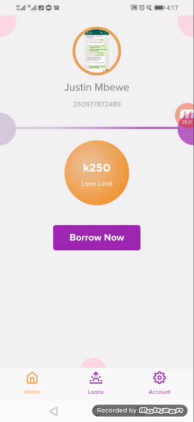
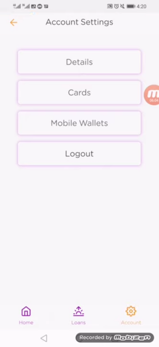
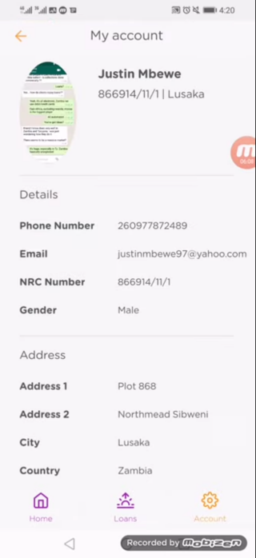

# Homepage Navigation

After the account has been created, the user is presented with a homepage. From this page, the user can view their profile picture, their registered name and phone number, and their loan limit. The loan limit is set in the admin panel and cannot be adjusted by the user.

When an account is freshly created, the user cannot borrow funds just yet as the account has to be activated. The account activation is done in the admin panel.

If the user wishes to change their profile picture, they can do so from this page by clicking on their current profile picture. They will be presented with a dialog box to confirm the action and can proceed to choose their new profile picture.

If the user wants to change any other details in their account such as adding or changing Cards and Mobile Wallets, they can click on the **Settings** tab and they will be presented with the screen shown below.

The user can change a number of settings from this tab such asadding cards and adding their mobile wallet details. They can also logout of the application from this screen.

To view their registered details, the user would click on the **Details** card and be presented with the screen shown below.

