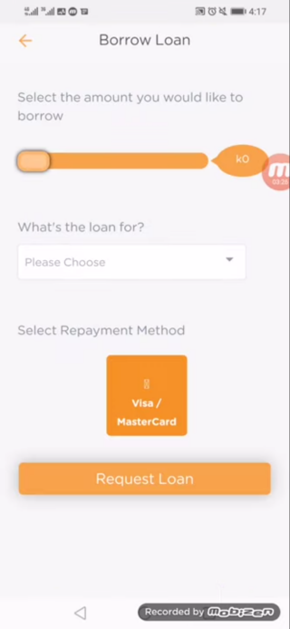
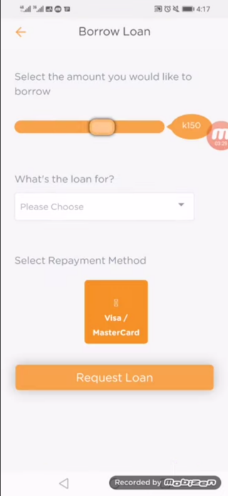
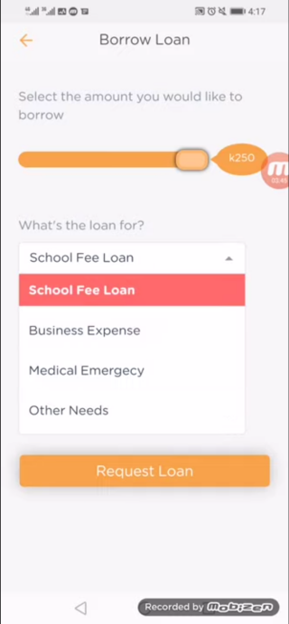
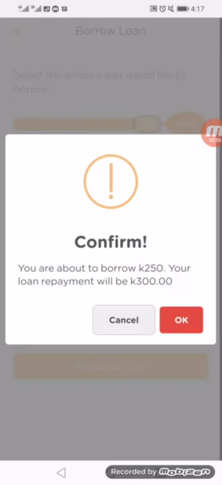
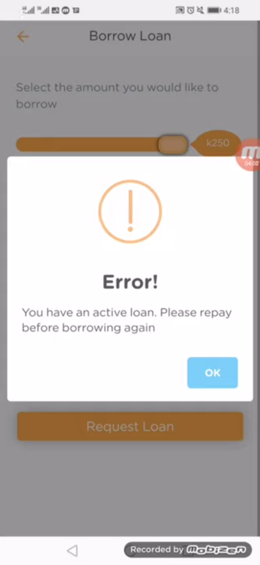

# Borrowing a Loan

After account activation, the user can begin the borrowing process by clicking on the **Borrow Now** button. The user will then be presented with a view containing a slider at the top, A dropdown menu in the middle section and a repayment method at the bottom.

The maximum limit for the amount that can be borrowed is set on the admin panel, which reflects on the slider.

After the user fills in the necessary details, a confirmation box pops up on the screen to confirm the loan being borrowed and the amount to be repaid after the specified time.

If the user has any active loans that are yet to be repaid, an error will occur and the user will be asked to repay the current loan before borrowing again.

Any active loans can be seen from the **Loans** tab.
