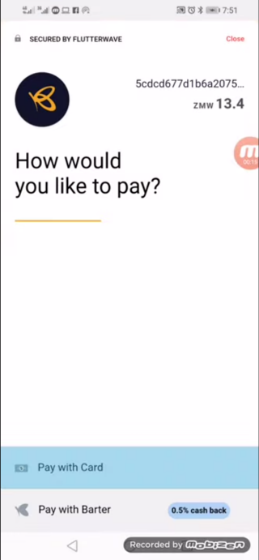
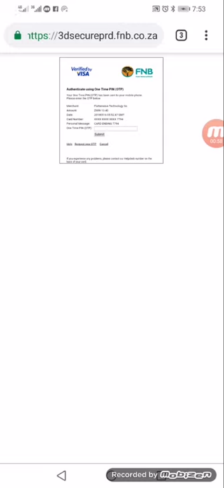

# Adding a Card

To enable automatic repayment of loans, the user may add their debit/credit card to the app. This can be done by first going to the **Account** tab and then selecting the **Cards** option.

A new user will be presented with a screen prompting them to add a new card to the system. Existing users will have the option of viewing their already existing cards and adding new cards to the system.

When the user clicks the **Add New Card** button, a modal, courtesy of [Flutterwave](https://flutterwave.com), pops up to enable the user to select how they would like to confirm their debit/credit card. The cost of confirming the card is equivalent to USD1.00.

Selecting **Pay with Card** allows the user to input their card details in a secure Flutterwave modal. After the card details are added, the user then selects the **Pay ZMW(Amount)** to confirm their debit/credit card. Depending on which bank the user is banks with, they may be asked to enter a One-Time PIN which they should receive on their preferred service i.e. SMS or email, in order to confirm that they initiated the payment and they own the card being used.

_**NB:** The money is reimbursed after the card is confirmed._
