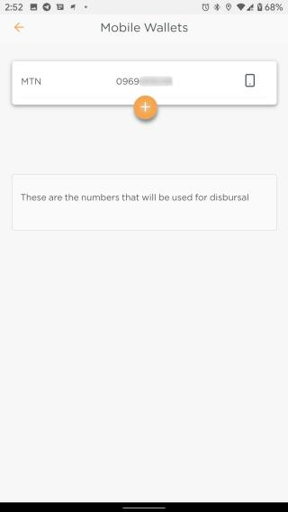

# Adding a Mobile Wallet

Disbursement of loans to the app users is done using Mobile Money platforms, the user may add their mobile wallet details to the app. This can be done by first going to the **Account** tab and then selecting the **Mobile Wallets** option.

A new user will be presented with a screen prompting them to add a new card to the system. Existing users will have the option of viewing their already existing cards and adding new cards to the system.

After pressing the button to add the the mobile number, the user will be presented with a screen to input their mobile number and then also their preferred mobile money platform.

Upon completion the user will be taken back to the Mobile Wallets View with showing the updated information.

