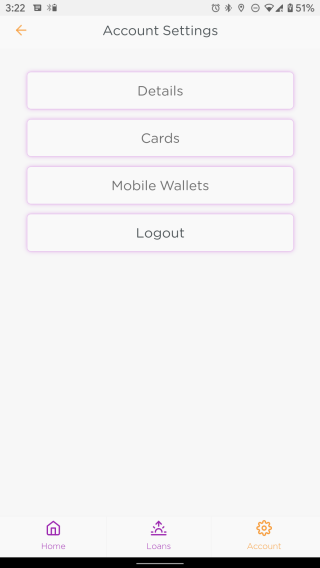

# Adding a Mobile Wallet

To enable automatic repayment of loans using Mobile Money platforms, the user may add their mobile wallet details to the app. This can be done by first going to the **Account** tab and then selecting the **Mobile Wallets** option.

A new user will be presented with a screen prompting them to add a new card to the system. Existing users will have the option of viewing their already existing cards and adding new cards to the system.

