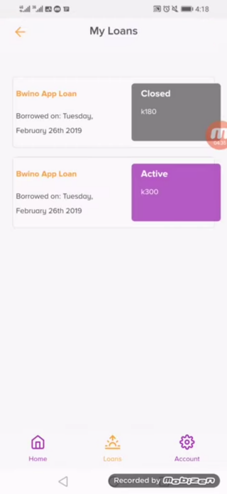
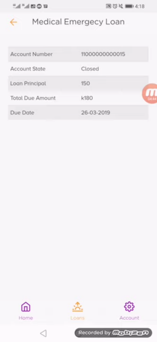
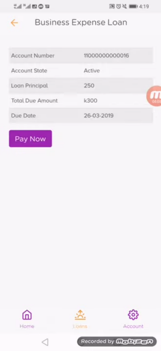

# Loans

The user can view their active loans and previous loans from the **Loans** tab. The loans are shown as a list of Cards which can be selected to view more details about each loan.

When the user clicks on a loan, they are able to see what type of loan it is — whether a Medical Emergency Loan or Business Expense Loan or otherwise — their account number of the loan, the state of the loan, the loan principal (amount borrowed), the total due amount (the amount to be repaid) and the due date for repayment of the loan.

For active loans, the user can choose to repay them by clicking on the **Pay Now** button if they have the funds ready and they do not wish to wait for the due date to make the payment.

